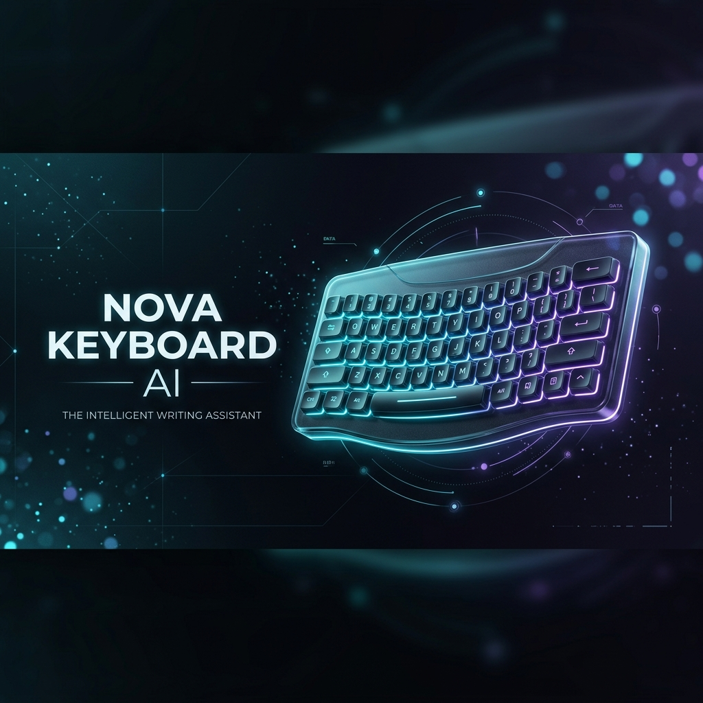
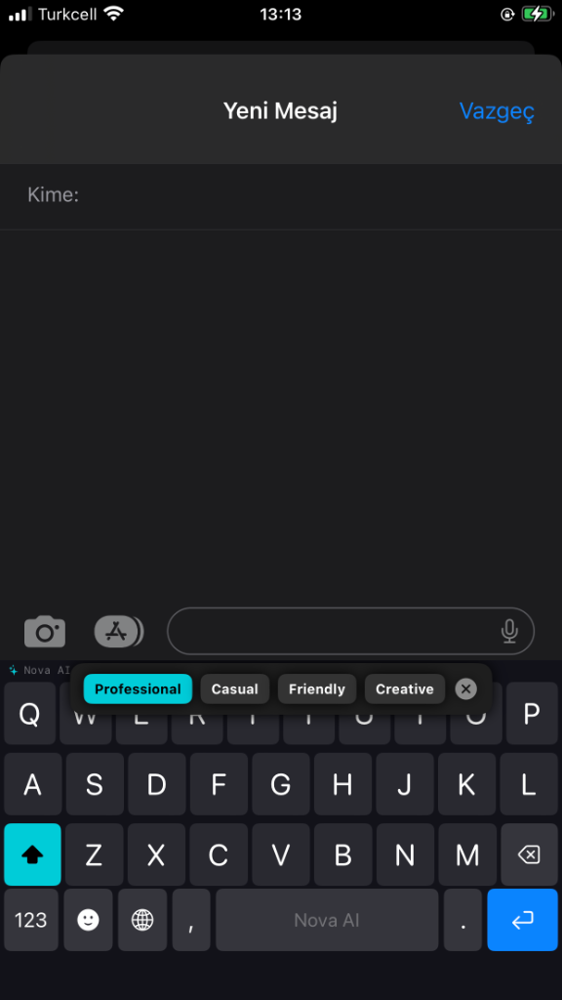
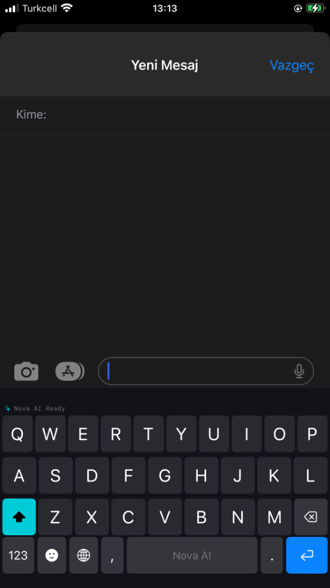
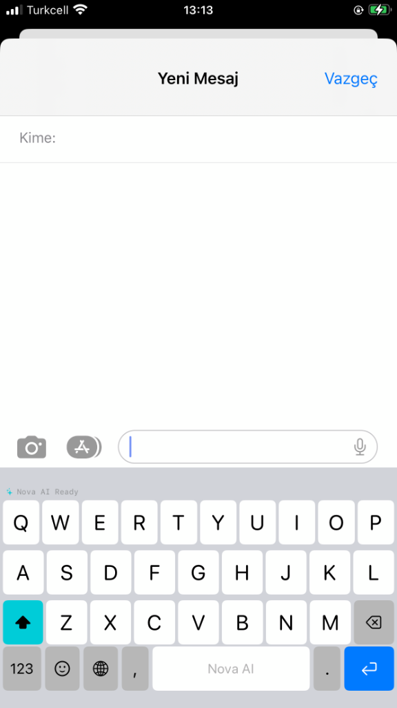
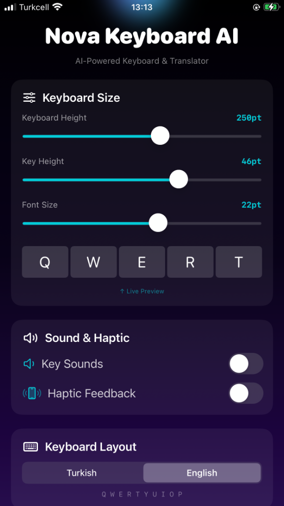
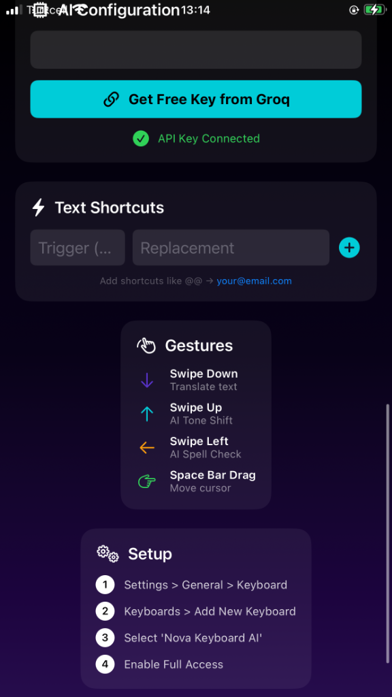

# Nova Keyboard AI 🧠⌨️

  

A powerful, professional-grade AI-enhanced iOS keyboard extension built with SwiftUI. Designed for the sideloading community (TrollStore/AltStore) with a focus on privacy, performance, and advanced AI integration.

---

## ✨ Features

### 🎭 AI-Powered Intelligence
Nova isn't just a keyboard; it's an assistant. Using the **Groq API (Llama 3.3 70B)**, it brings desktop-class AI to your fingertips with zero latency.

  
  
  

| Feature | Gesture | What it does |
|---------|---------|-------------|
| 🎭 **AI Tone Shift** | Swipe Up | Rewrite text as Professional, Casual, Friendly, or Creative |
| 🌍 **AI Translation** | Swipe Down | Translate between 13+ languages instantly |
| ✏️ **AI Spell Check** | Swipe Left | Fix grammar and spelling (language-aware) |
| 🎯 **Cursor Control** | Hold Space + Drag | Move cursor precisely |
| 📋 **Smart Clipboard** | Tap banner | One-tap paste recently copied text |

### 🛠️ Professional Customization
Tailor the keyboard to your typing style.

  
  

- **Dynamic Sizing:** Adjust Keyboard Height, Key Height, and Font Size with live preview.
- **Haptic & Sound:** Premium tactile feedback and key sounds (toggleable).
- **Dual Layouts:** Full support for Turkish and English QWERTY.
- **Long-Press Alternates:** Hold any letter to access accented characters (À, Ş, Ç, Ğ, etc.).
- **Rich Emoji Grid:** 300+ emojis organized into 7 searchable categories.
- **Smart Shortcuts:** Define custom triggers (e.g., `@@` → `your@email.com`).

---

## 🔐 Privacy & Security

- **Bring Your Own Key (BYOK):** Use your own personal [Groq API Key](https://console.groq.com/keys) — free tier available.
- **On-Device Storage:** Your API key and shortcuts never leave your device.
- **Zero Analytics:** No tracking, no data collection, no telemetry.
- **ATS Restricted:** Network access limited to `api.groq.com` only.
- **Full Access Detection:** Keyboard automatically detects and redirects to Settings if Full Access is off.

---

## 📱 Requirements

- **iOS 14.0 - 17.0+** (Tested on TrollStore 2 & Sideloaded environments)
- **Groq API Key** ([Get one free here](https://console.groq.com/keys))

---

## 🚀 Installation & Setup

1. **Download** the `.tipa` from [Releases](https://github.com/Son3ra1n/NovaKeyboardAI/releases).
2. **Sideload** via **TrollStore** or **AltStore**.
3. **Enable:** `Settings → General → Keyboard → Keyboards → Add New Keyboard → Nova Keyboard AI`.
4. **Full Access:** Toggle **Allow Full Access** (required for AI features).
5. **Configure:** Open the Nova app, paste your Groq API key, and you're ready!

> **Note:** Jailbreak is NOT required. TrollStore works on many devices without jailbreak.

---

## 🏗️ Technical Highlights

- **Cached Engine:** Zero `UserDefaults` reads during active typing.
- **Simultaneous Gestures:** Swipe detection doesn't block tap latency.
- **Result-Based AI:** Typed error handling with HTTP status differentiation (401/429/5xx).
- **Safe Async Replacement:** `hasSuffix` verification prevents text loss during AI requests.
- **SwiftUI + UIKit Hybrid:** Best of both worlds for performance and UI flexibility.

---

## 🤝 Contributing

See [CONTRIBUTING.md](CONTRIBUTING.md) for build instructions and fork guidelines.

## 🔒 Security

See [SECURITY.md](SECURITY.md) for our privacy model and threat analysis.

---

## 👤 Author

**Son3ra1n** — [GitHub](https://github.com/Son3ra1n) | [Reddit](https://reddit.com/u/Son3ra1n)

---

*Built with ❤️ and AI for the iOS Community.*
